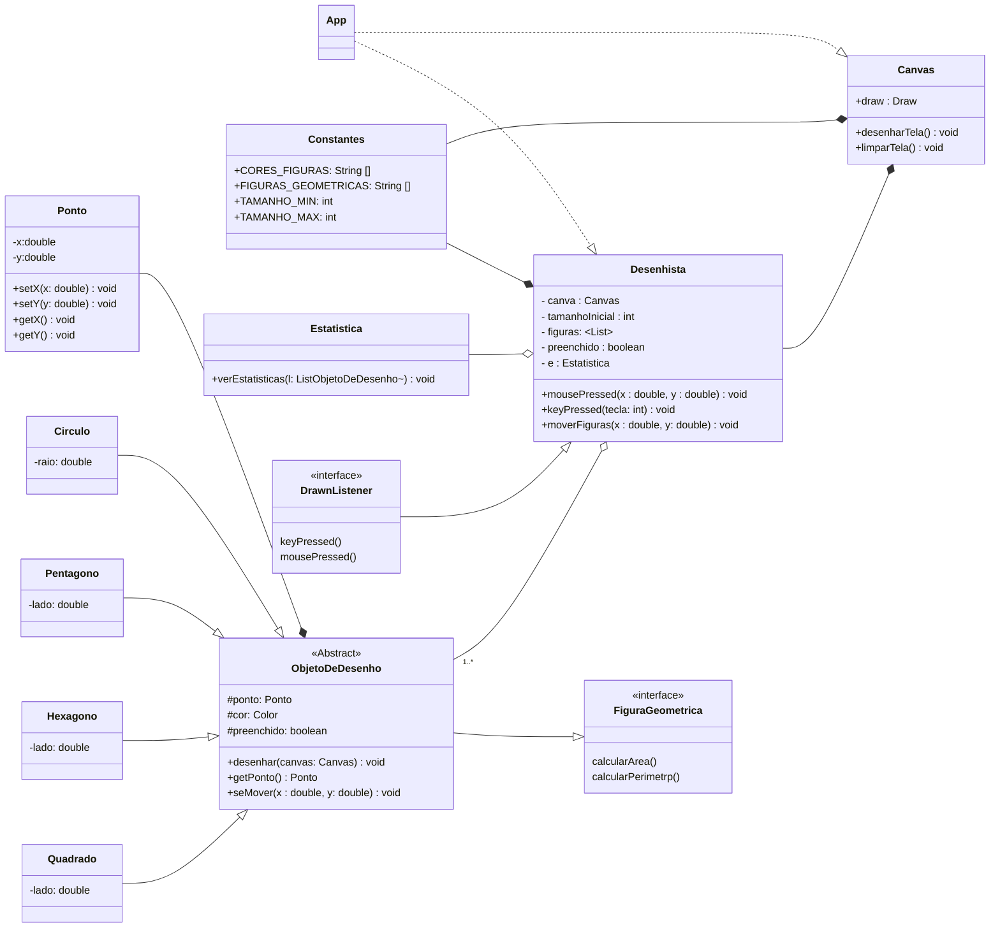

# Engenharia de Telecomunicações - Programação Orientada a Objetos
## Bernardo Souza Muniz - Lista 4

### Como usar o repositório
Para clonar o repositório para a sua máquina local utilizando Git, basta executar o seguinte comando no seu terminal:

`git clone https://github.com/sergio-prolo-class/lista-4-BernardoMuniz39`

### Sobre
Este repositório tem o objetivo de apresentar a resolução da lista 4 da disciplina de Programação orientada a objetos que implementa que implementa um aplicativo de desenho vetorial. Durante a realização do projeto, foi utilizada a biblioteca **algs4** para desenhar as figuras geométricas.

Para utilizar o projeto, certifique-se de estar dentro da pasta clonada e com o gradle instalado no seu computador. Digite o seguinte comando no terminal da sua máquina local:

`gradle run` ou `./gradlew run`

## Diagrama UML
O esquema abaixo representa o diagrama UML do projeto:

## Aplicativo de desenho vetorial
O resumo abaixo disponibiliza um manual que contém as funcionalidades técnicas implementadas no projeto. Nele contém as teclas que devem ser pressionadas no teclado para que seja visualizado os desenhos vetoriais.
#### Funcionalidades técnicas
- **F1 - F4:** Alterna entre as figuras círculo, quadrado, pentágono e hexágono.
- **F5 - F8:** Alterna as cores entre preto, vermelho, azul e verde.
- **Q:** Aumenta a figura de tamanho.
- **W:** Diminui a figura de tamanho
- **F:** Permite alternar entre uma figura com preenchimento e sem preenchimento. Caso for com preenchimento, a figura será impressa com a cor atualmente selecionada e com a borda preta. Se não, será impressa uma figura vazada com a cor da borda sendo a atualmente selecionada.
- **P:** Permite ver estatísticas contendo o total de figuras impressas, a média das áreas e a soma dos perímetros.
- **UP, DOWN, LEFT, RIGHT:** Permite mover todas as figuras nas quatro direções cardinais utilizando as setas do teclado.